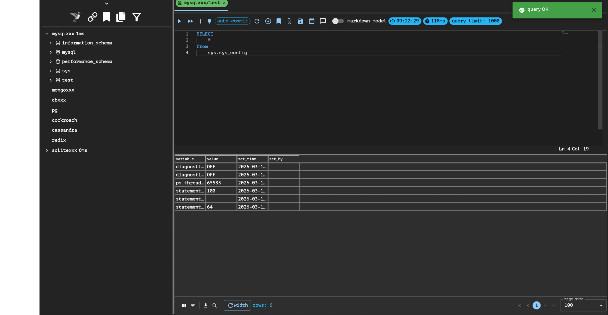
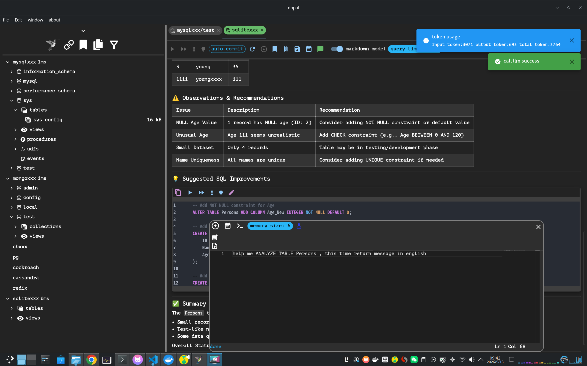
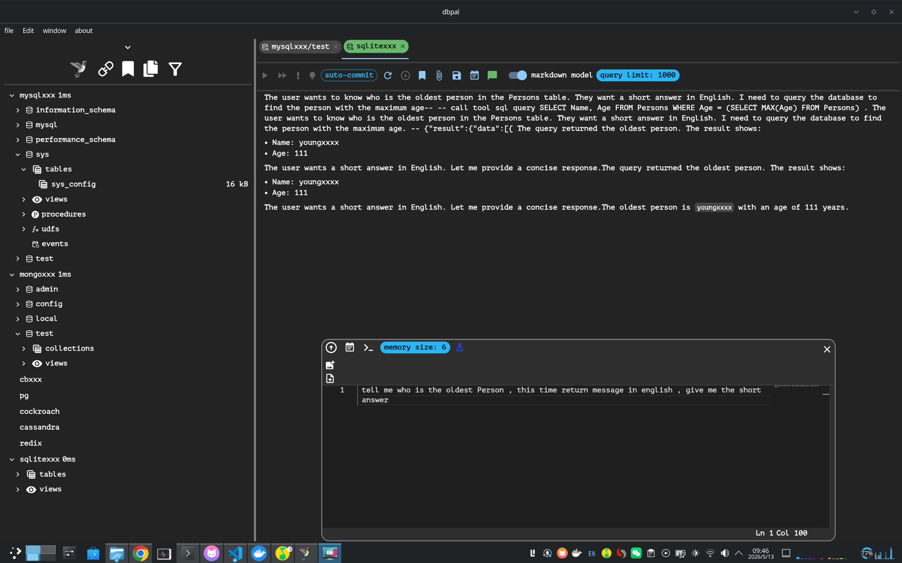
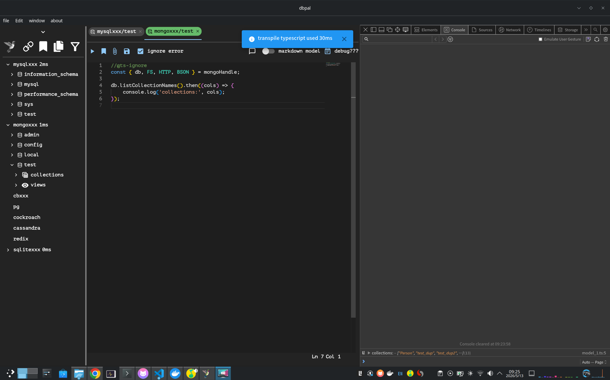
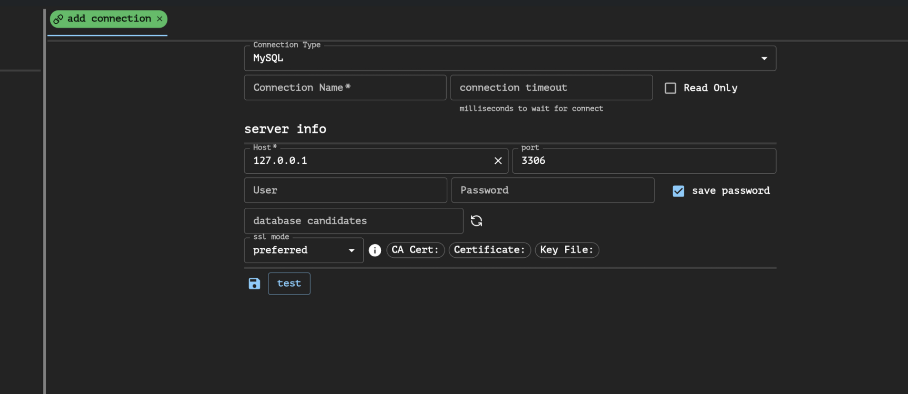
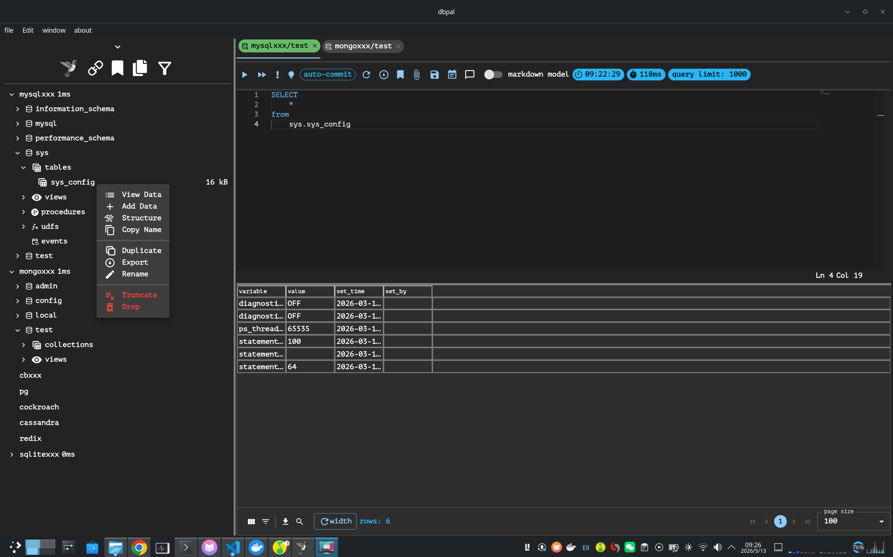
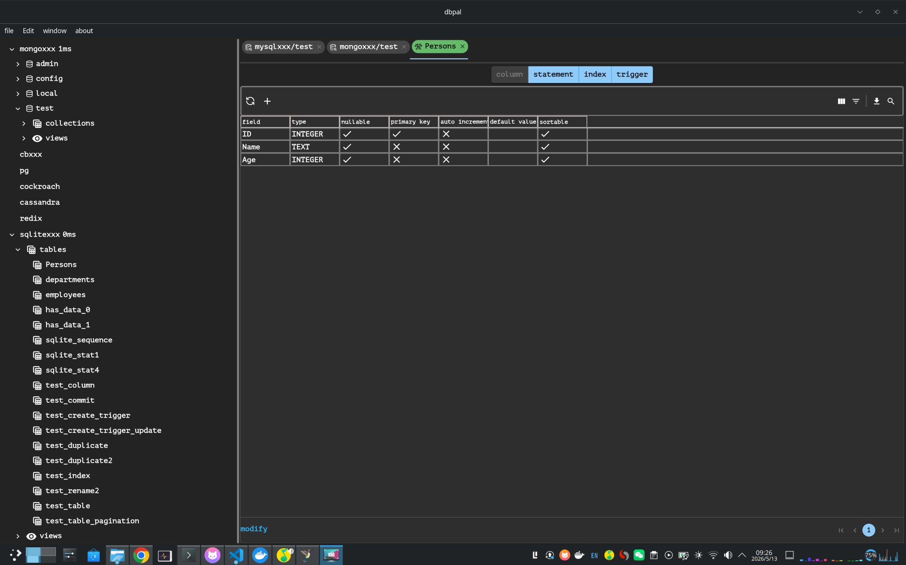
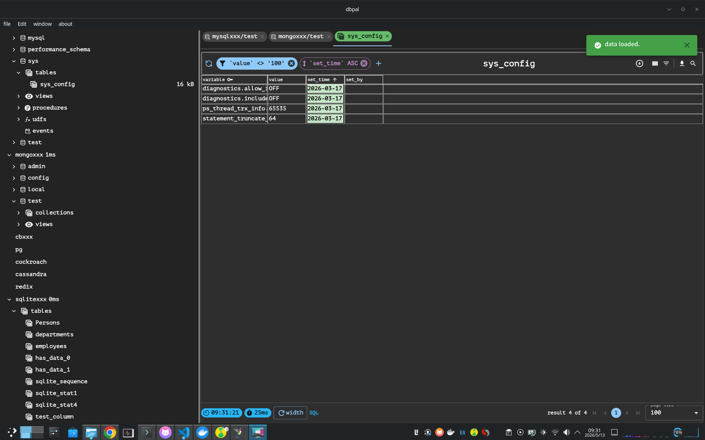

# dbpal 

 **dbpal is a very simple database management system with good
        functionality, ease of use and low resource usage. It supports postgres,
        mysql, sqlite, etc...**

## Donation
* [windows](https://apps.microsoft.com/detail/9nw4d1fn94kn?hl=en-US&gl=US)
* [ko-fi](https://ko-fi.com/young38925)
* 
* 

   

## Install
https://github.com/yuyang-ok/dbpal/releases

macos need extra command to run,somehow I have difficulties to apply developer account.

~~~
# after install on macos execute  
xattr -d com.apple.quarantine /Applications/dbpal.app  
~~~

##  supported database system
* mysql
* tidb
* mariadb
* sqlite
* redis 
* mongo
* oracle
* sql server(microsoft)
* postgres
* clickhouse
* libsql
* firebird
* cockroach
* cassandra
* duckdb 
* couchbase

## AI Powered chat 

## report issue
[issue](https://github.com/dbpal/docs/issues)

## features
* easy to use
* fast
* low memory consumption
* low cpu usage
* sql editor(auto completion ,high light)
* security (power by rust)
* small binary size
* export query to file
* export table or view to file
* streamed query through rust [Stream](https://docs.rs/futures/latest/futures/prelude/trait.Stream.html) and [Channel](https://v2.tauri.app/develop/calling-frontend/#channels)
* start at instant
* separate query window

## mongo query editor
mongo use webkit build in js interpreter via `eval`, `dbpal` predefine
some variable for interact with database such as `db` etc ...

 

## Privacy Policy
Effective Date: April 28, 2025
 
At dbpal, we are committed to protecting your privacy. This Privacy Policy outlines our practices regarding the collection, use, and protection of your information.

1. Information We Do Not Collect
   
  We do not collect any personal information from our users. This includes, but is not limited to:
    * Names
    * Email addresses
    * Phone numbers
    * Payment information
    * Location data
2. Use of Information 
 
Since we do not collect any personal information, we do not use, share, or sell any user information to third parties.

3. Changes to This Privacy Policy 
   
We may update this Privacy Policy from time to time. We will notify you of any changes by posting the new policy on our website. Your continued use of our services after any changes indicates your acceptance of the new policy.

4. Contact Us
   
If you have any questions about this Privacy Policy, please contact us at:
756445638@qq.com 

## screen shots

