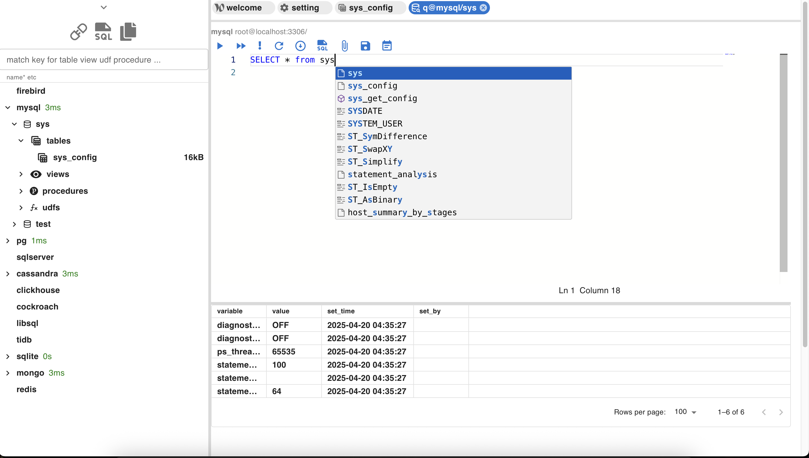

# dbpal 

 **dbpal is a very simple database management system with good
        functionality, ease of use and low resource usage. It supports postgres,
        mysql, sqlite, etc...**

## video demo
[video](https://www.youtube.com/watch?v=rQiUqanW2sM)
[中文](https://www.youtube.com/watch?v=rQiUqanW2sM)

##  support those database system
* mysql
* tidb
* mariadb
* sqlite
* redis 
* mongo
* oracle
* sql server(microsoft)
* postgres
* clickhouse
* libsql
* firebird
* cochroach
* cassandra

## design goal
* easy to use
* fast
* low memory consumption
* low cpu usage
* sql editor
* open a lot of tabs
* security (power by rust)
* small binary size
* export query to file
* export table or view to file

## mongo query editor
mongo use webkit build in js interpreter via `eval`, `dbpal` predefine
some variable for interact with database such as `db` etc ...

 

 
full predefined variable and types see the code blow.

~~~typescript
 interface ILogger {
    trace: (...msg: any[]) => void;
    debug: (...msg: any[]) => void;
    log: (...msg: any[]) => void;
    info: (...msg: any[]) => void;
    warn: (...msg: any[]) => void;
    error: (...msg: any[]) => void;
  }

interface IMongoDB {
  collection: (name: string) => IMongoCollection;
  createcollection: (name: string) => IMongoCollection;
  drop: () => Promise<void>;
  listCollectionNames: () => Promise<string[]>;
  runCommand: (doc: BSON.Document) => Promise<BSON.Document>;
}

interface IMongoCollection {
  cuntDocuments: () => Promise<number>;
  createIndex: (index: BSON.Document) => Promise<string>;
  createSerachIndex: (
    index: BSON.Document,
    name: string | null
  ) => Promise<string>;
  deleteMany: (filter: BSON.Document) => Promise<BSON.Document>;
  deleteOne: (filter: BSON.Document) => Promise<BSON.Document>;
  distinct: (field: string, filter: BSON.Document) => Promise<any[]>;
  drop: () => Promise<void>;
  dropIndex: (name: string) => Promise<void>;
  dropIndexes: () => Promise<void>;
  dropSearchIndex: (name: string) => Promise<void>;
  find: (filter: BSON.Document) => IFind;
  findOne: (filter: BSON.Document) => IFindOne;
  findOneAndDelete: (filter: BSON.Document) => Promise<BSON.Document | null>;
  findAndReplace: (
    filter: BSON.Document,
    replacement: BSON.Document
  ) => Promise<BSON.Document | null>;
  insertMany: (docs: BSON.Document[] | BSON.Document) => Promise<any>;
  insertOne: (doc: BSON.Document) => Promise<any>;
  listIndexNames: () => Promise<string[]>;
  listIndexes: () => Promise<any[]>;
  listSearchIndexes: () => Promise<BSON.Document[]>;
  // collection name;
  name(): string;
  replaceOne: (
    query: BSON.Document,
    replacement: BSON.Document
  ) => Promise<any>;
  updateMany: (
    query: BSON.Document,
    doc: BSON.Document
  ) => Promise<any>;
  updateOne: (
    query: BSON.Document,
    docs: BSON.Document
  ) => Promise<any>;
}

interface IFindCommon {
  max: (doc: BSON.Document) => IFind;
  min: (doc: BSON.Document) => IFind;
  projection: (doc: BSON.Document) => IFind;
  sort: (doc: BSON.Document) => IFind;
  skip: (x: number) => IFind;
}
interface IFindOne extends IFindCommon {
  find: () => Promise<BSON.Document>;
}

interface IFind extends IFindCommon {
  limit: (x: number) => IFind;
  find: () => Promise<BSON.Document[]>;
}

class BsonExtraDataType {
  newLong(...args): BSON.Long {
    //@ts-ignore
    return new BSON.Long(...args)
  }

  newObjectID(inputId?: string | number | BSON.ObjectId | BSON.ObjectIdLike | Uint8Array): BSON.ObjectId {
    return new BSON.ObjectId(inputId);
  }
  newInt32(...args): BSON.Int32 {
    //@ts-ignore
    return new BSON.Int32(...args);
  }

  newTimeStamp(...args): BSON.Timestamp {
    //@ts-ignore
    return new BSON.Timestamp(...args)
  }
  newDecimal128(bytes: Uint8Array | string): BSON.Decimal128 {
    return new BSON.Decimal128(bytes);
  }
  newJavaScriptCode(code: string | Function, scope?: Document | null): BSON.Code {
    return new BSON.Code(code, scope);
  }
  newBinary(...args): BSON.Binary {
    //@ts-ignore
    return new BSON.Binary(...args);
  }
  binaryCreateFromHexString(hex: string, subType?: number): BSON.Binary {
    return BSON.Binary.createFromHexString(hex, subType);
  }
  binaryCreateFromBase64(base64: string, subType?: number): BSON.Binary {
    return BSON.Binary.createFromBase64(base64, subType);
  }
  binaryFromInt8Array(array: Int8Array): BSON.Binary {
    return BSON.Binary.fromInt8Array(array)
  }
  binaryFromFloat32Array(array: Float32Array): BSON.Binary {
    return BSON.Binary.fromFloat32Array(array)
  }
}
    var db : IMongoDB;
    var logger : ILogger;
    var bsonExtraDataType : BsonExtraDataType
~~~

## mongo dsl
a small dsl to support all bson data types. mongo has more type than
json so we decide to develop a small dsl to support those data types.
 
It is very simple that no need to learn.
 
It used in a lot of places like edit , view data.

 
here is a demo

~~~
 {
  _id: '67ff4141df774f7cb32f77d3' as ObjectID,  // convert a to ObjectID
  string_field: 'Hello, world!',
  int_field: 123,
  float_field: 123.45,
  bool_field: true,
  date_field: '2025-04-16T05:33:53.000Z' as date,
  null_field: null,
  regex_field: /haha/i,  // regexp
  // binary
  binary_field: [ 1, 2 ] as binary vector int8,
  binary_field2: [ 1, 2 ] as binary vector float32,
  binary_field3: [ 104, 101, 108, 108, 111 ] as binary generic,
  binary_field4: [ 104, 101, 108, 108, 111 ] as binary encrypted,
  binary_field5: [ 104, 101, 108, 108, 111 ] as binary user_define 10,
  uuid_field: [ 123, 199, 23, 38, 202, 184, 67, 6, 151, 11, 43, 111, 236, 163, 109, 7 ] as binary uuid,
  array_field: [ 1, 2, 3 ],
  object_field: { nested_key: 'nested_value' },
  decimal_field: '1' as decimal,
  timestamp_field: 1744781633 as timestamp 1  // 1 as increment
}

~~~

## screen shots

